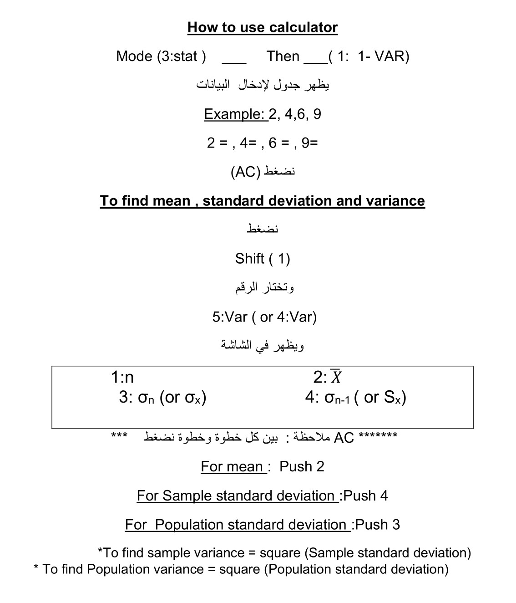

# $3^{rd}$ Tutorial


::: {.exercise}
Appendix C in the [textbook](https://ksusa-my.sharepoint.com/:b:/g/personal/aalharbi10_ksu_edu_sa/EXiGXqS0oLNEij_721SyVh8BXcTk6m4xa69ExysLpaxBKg?e=etSYh4) gives data related to the number of tractors in 30 serially numbered
villages of Doraha development block in Punjab (India). Select (1) WR and (2)
WOR simple random sample of 10 villages using direct approach method.
:::

```{r, echo=FALSE}
DF3 = read.csv("DATA3.csv")
knitr::kable(DF3, col.names = c("Village No." ,"Village name","Tractors","Tube wells", "Irrigiated area"), align = "lccrr")
```

\begin{align}
 &N=30\\
 \
 &\mu=\frac{\sum Y_i}{N}=22.5667\\
 \
 &\sigma^2 = \frac{\sum Y_i-\mu}{N}=273.3789\\
 \
 &\sigma=\sqrt{273.3789} = 16.5342

\end{align}


Here village is the sampling unit. The villages in the population are already serially numbered which, otherwise, is the first step involved in the sample selection. Refer to Appendix B, and use first column by dropping the last two digits of each four-digit number. Then we see that the first random number thus formed is 11. Similarly, the subsequent random numbers are seen to be $5,26,11, ... ,3$
\
\
(1) By selecting the first 10 random numbers from 1 to 30, without discarding Repetitions (WR), we obtain the serial numbers of villages in the sample. These are given below along with their variable values (number of tractors).


```{r, echo=FALSE}
DF4 = data.frame(Village=c(11,5,26,11,11,24,12,22,9,3),Tractors=c(11,12,22,11,11,21,30,16,20,5))
knitr::kable(t(DF4), raw.names = c("Village","Tractors"), align = "lccrr")

```

One can see that 11th village has been selected twice in the with replacement simple random sample where repeated selection of units is permitted.

\begin{align}
 &n=10\\
 \
 &\bar{y}=\frac{\sum Y_i}{n}=15.9\\
 \
 &s^2 = \frac{\sum Y_i-\bar{y}}{n-1}=53.87789\\
 \
 &\text{Sampling variance:}~V(\bar{y}) = \frac{\sigma^2}{n}=\frac{273.3789}{10} = 27.3379\\
 \
 &\text{Standard error of the sample mean:} se(\bar{y})=\sqrt{V(\bar{y})} = 5.2286\

\end{align}

The confidence interval for the population mean $\mu$ are given by
$$\bar{y}\pm2~se(\bar{y})$$
$$\Rightarrow \mu \in [5.4428,26.3572]$$


Unbiased estimator of
$$𝑉(\bar{y}) =v(\bar{y})=\frac{s^2}{n}=\frac{53.8778}{10}= 5.38778$$
(2) In without replacement sample, any repetition (11th village in the present case) is omitted, and another random number is selected as its replacement. Next random numbers from 1 to 30 are 7 and 25. Thus the WOR simple random sample of 10 villages from the population under study is with the following serial numbers:

```{r, echo=FALSE}
DF5 = data.frame(Village=c(11,5,26,24,12,22,9,3,7,25),Tractors=c(11,12,22,21,30,16,20,5,44,7))
knitr::kable(t(DF5), raw.names = c("Village","Tractors"), align = "lccrr")

```

\begin{align}
 &n=10\\
 \
 &\bar{y}=\frac{\sum Y_i}{n}=18.8\\
 \
 &s^2 = \frac{\sum Y_i-\bar{y}}{n-1}=135.7333\\
 \
 &\text{Sampling variance:}~V(\bar{y}) = \frac{N-n}{Nn}\sigma^2=\frac{30-10}{30\times~10}\times282.8057 = 18.8537\\
 \
 &\text{Standard error of the sample mean:} se(\bar{y})=\sqrt{V(\bar{y})} = 4.3421\

\end{align}

The confidence interval for the population mean $\mu$ are given by
$$\bar{y}\pm2~se(\bar{y})$$
$$\Rightarrow \mu \in [10.1158,27.4842]$$


Unbiased estimator of
$$𝑉(\bar{y}) =v(\bar{y})==\frac{N-n}{Nn}~s^2=\frac{30-10}{30\times10}\times135.7333= 10.557$$


::: {.exercise}
The height (in cm) of 6 students of M.Sc., majoring in statistics, from Punjab Agricultural University, Ludhiana was recorded during 1985. The data, so obtained, are given below:
:::


```{r, echo=FALSE}
DF6 = data.frame(Student=1:6, Name=c("Sarjinder Singh","Gurmeet Singh","Varinder Kumar","Sukhjinder Singh","Denivder Kumar","Gulshan Kumar"),Height=c(168,175,185,13,171,172))
knitr::kable(DF6, col.names = c("Student","Name","Height"), align = "lccrr")

```


1. Calculate (a) population mean $\mu$, and (b) population variance $\sigma^2$.
2. Enumerate all possible SRS with replacement samples of size n=2. Obtain
sampling distribution of mean, and hence show that
a. $E(\bar{y}) = \mu$
b. $V(\bar{y}) =\frac{\sigma^2}{n}$
c. $E(s^2) = \sigma^2$
d. $E[v(\bar{y})] = V(\bar{y})$

By R:
(1)
```{r}
Y <- c(168,175,185,173,171,172)
N <- 6
(Ybar <- mean(Y))
(Sigmasquare <- var(Y)*((N-1)/N))
```

(2)

```{r, }
n <- 2
(No.s<- N^n) #Number_of_all_possible_samples
#install.packages("tidyverse")
library(tidyverse)
sample <- crossing (Var1=Y, Var2=Y)
samples<- sample (Y, 2, replace= TRUE)
(ybars= apply(sample,1 , mean))
#for a matrix 1 indicates rows,2 indicates columns or rowMeans(sample)
(unbiased_mean <- mean(ybars))
```


```{r, warning=FALSE,message=FALSE}
Ybarsquare <- (ybars)^2
(Variance_Of_ybar <- mean(Ybarsquare) -(unbiased_mean)^2)
(Sigmasquare/n)
#install.packages("matrixStats")
library(matrixStats)
ssquare <- rowVars(as.matrix(sample))
mean(ssquare)
```


::: {.execise}
From the data given in Example 3.2, enumerate all the SRS without
replacement samples of size n=2, and write down sampling distribution of
mean. Using this distribution, show that:
:::

(a) $E(\bar{y})=\mu$
(b) $Var(\bar{y})=\frac{N-n}{Nn}S^2$
(c) $E(s^2)=S^2$
(d) $E(v(\bar{y}))=V(\bar{y})$

\
By R:
```{r, message=FALSE, warning=FALSE}
Y <- c(168,175,185,173,171,172)
n <- 2
(No.s<- choose(N,n))
(samples <- combn(Y,n))
(ybars= apply(sample,2, mean))
#for a matrix 1 indicates rows,2 indicates columns or colMeans(samples)
(unbiased_mean <- mean(ybars))
Ybarsquare <- (ybars)^2
(Variance_Of_ybar <- mean(Ybarsquare) -(unbiased_mean)^2)
(Ssquare <- var(Y))
(N-n)/(N*n) * Ssquare
#install.packages("matrixStats")
library(matrixStats)
ssquare <- colVars(samples)
mean(ssquare)
```

::: {.exercise}
From the WR sample of 10 villages selected in example 3.1, estimate the average number of tractors per village in the block along with its standard error. Also, set up confidence interval for the population mean.

:::


```{r, echo=FALSE}
DF7 = data.frame(Village=c(43,61,58,62,47,34,11,43,5,53),Tractors=c(14,8,15,39,9,14,11,19,12,18))
knitr::kable(DF7, col.names = c("Village","Tractors"), align = "lccrr")

```

Average number of tractors per village in the block is:

$$\bar{y}=\frac{1}{10}\sum_{i=1}{10}y_i = \frac{159}{10}=15.9$$
To find the standard error, we first calculate sample mean square

$$s^2=\frac{1}{n-1}\sum_{i=1}{n}y_i^2-n\bar{y}^2=78.32222$$
The estimate of the variance is given by:
$$v(\bar{y})=\frac{s^2}{n}=\frac{ 78.3222}{10}= 7.83222$$

Estimate the standard error of the sample mean is:
$$se(\bar{y})=\sqrt{7.83222}=2.7986$$

The lower and upper limits of the confidence interval for 𝑌̅ are given by:

\begin{align}
\bar{y}\pm~2\times~se(\bar{y})
\Rightarrow \bar{y} \in [10.3028 , 21.497]


\end{align}

\
\
\
\
\
\
