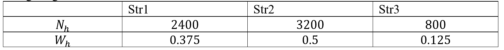
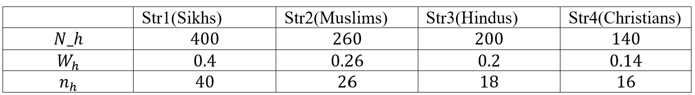
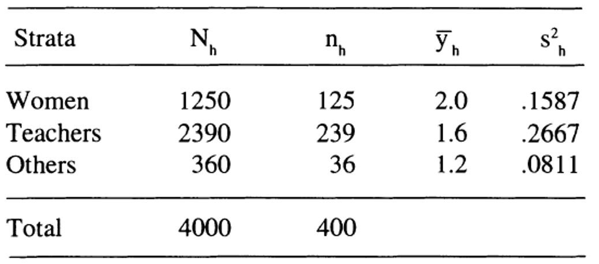

 
# 8th Tutorial 

::: {.exercise}

A stratified sample of size 80 is to be drawn from a population of 6400
units, divided into 3 strata of sizes 2400, 3200, and 800 units. If the allocation
is to be equal, or proportional, how many units should be selected from individual
stratum in each case?

:::

The giving information as follows in the table:

**Equal allocation:**  The number of units to be selected from each stratum will be $n_h=\frac{n}{L}=\frac{80}{3}=26.6667≈27$. So $n_1=n_2=n_3=27$.

**Proportional allocation:** The number of units to be selected from each stratum will be 

$$n_1=N_1/N  n=W_1× n=0.375*80= 30$$
$$n_2=W_2\times n=0.5×80=40$$
$$n_3=W_3\times n=0.125×80=10$$

::: {.exercise}
The adult popUlation in a colony consists of 400 Sikhs, 260 Muslims, 200 Hindus, and 140 Christians. An investigator selected 40 Sikhs, 26 Muslims, 18 Hindus, and 16 Christians so as to draw a total sample of 100 adults. Do you think the allocation is proportional ?
:::

The giving information as follows in the table:

In order for the sampling to be proportional, the number of units to be selected from each stratum should be

$$n_1=W_1\times n=0.4×100= 40$$
$$n_2=W_2\times n=0.26×100=26$$
$$n_3=W_3\times n=0.2×100=20$$
$$n_4=W_4\times n=0.14×100=14$$
::: {.exercise}
During 1990-91 session, a student doing M.Sc. (Statistics) was given a project to estimate average time taken by the university employees to get ready for office in the morning. The population was grouped into 3 strata. The first stratum consisted of women. The males were divided into 2 strata - teachers and the other staff. A WOR random sample of 400 employees was drawn using proportional allocation. The information on time (in hours) taken by selected respondents to be ready for office was collected. Below are given the sample average and sample mean square for each stratum along with the values of $N_h$ and $n_h$

:::

Estimate the average time taken to get ready for office, and place the required confidence limits on it.

$$\bar{y}_{str}=W_{1} \bar{y}_1+W_2 \bar{y}_2  +W_3 \bar{y}_3$$

$$=  \frac{1}{2000} (1250×2+2390×1.6+360×1.2 ) = 3.378$$

$$var(\bar{y}_{str} )=\sum_{h=1}^{L} W_h^2  \frac{N_h-n_h}{N_h} \times \frac{s_h^2}{n_h}$$

$$=(\dfrac{1250}{4000})^2×\dfrac{1250-125}{1250\times~125}×0.1587+\dfrac{2390}{4000}^2×\dfrac{2390-239}{2390\times~239}×0.2667+\dfrac{360}{4000}^2×\dfrac{360-36}{360*36}×0.0811 =0.0005$$

we obtain the limits of confidence interval as
$$\bar{y}_{str} \pm Z_{1-∝/2}  \sqrt{v(\bar{y}_{str})}$$
$$3.378±2 \sqrt{0.0005} $$   
 $$[ 3.333279,3.422721 ]$$

::: {.exercise}
Take the estimates of strata mean squares obtained in exercise 5.9 as known. Using this information along with strata sizes, determine Neyman allocation when the total budget at disposal is Rs 1000. Assume that the overhead cost, and the cost of eliciting and processing information per respondent, are Rs 100 and Rs 3 respectively.
:::

$$C=Rs ~~ 1000~~~~~~~~,C_o=Rs~~100,~~~~~~~~~~C_h=Rs ~~ 3$$

$$n=\dfrac{C-C_o}{C_h} =\dfrac{1000-100}{3}= 300 $$

$$n_h=n \dfrac{N_h s_h}{\sum_{h=1}^L N_h s_h} ~~~~~,h=1,2,3$$
$$\sum_{h=1}^L N_h s_h= 1250× 0.1587+ 2390× 0.2667+360× 0.0811=864.984$$

$$n_1=300×\dfrac{1250× .1587}{864.984} =68.80185≈ 69$$

$$n_2=300×\dfrac{2390× 0.2667}{864.984}=221.0722≈ 221$$

$$n_2=300×\dfrac{360× .0811}{864.984}=10.12597≈ 10$$

