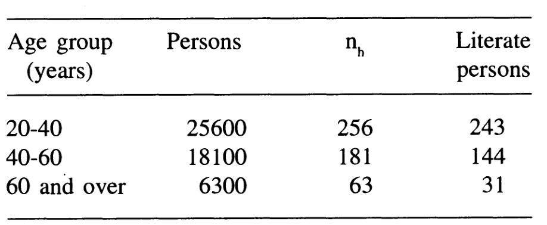
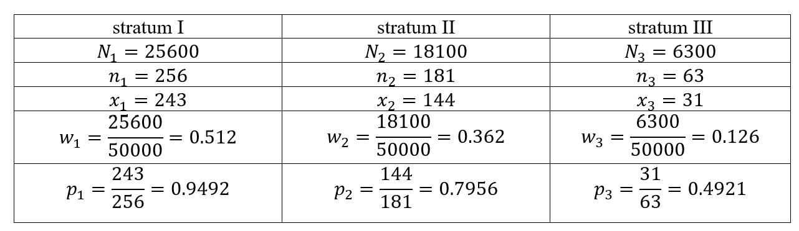

 
# 9th Tutorial 

::: {.exercise}
All the 80 farms in a population are stratified by farm size. The expenditure on the insecticides used during the last year by each farmer is presented in the dataset
:::
```{r}
urlfile<- "https://raw.githubusercontent.com/F3bdulmajeed/STAT_331/main/farmdata.csv"
Farms<-read.csv(urlfile)
```

1. Compute the overall population mean $\bar{Y}$ and the population mean square $S^2$. 
2. Verify that population mean equal the weighted average of the means of the strata.
3. Determine the number of units to be selected from each stratum with proportional allocation, equal allocation, and Nyman allocation of a sample of size $n=24$.
4. Determine the variance of the sample mean for stratified sampling with proportional allocation,  equal allocation, and Nyman allocation of a sample of size $n=24$. Assume that the sampling is WOR.
5. Compare the relative precision of stratified sample mean $\bar{Y}_{str}$ based on each of the above mentioned allocations, with respect to the simple random sample mean $\bar{Y}_{srs}$
6. Select a stratified sample of $24$ farmers by using Proportional allocation.(use R program)


```{r}

Farm = Farms$ï..Farm
Y<-Farms$Expenditure
stratum <-Farm
table(stratum)

## compute population size, mean for each stratum 1,2 and 3.
#sample size, mean and var for strata 1
Y1<-Y[Farm == 1]
N1=length(Y1)
Y1_bar=mean(Y1)
V1=var(Y1)
#sample size, mean and var for strata 2
Y2<-Y[stratum==2]
N2=length(Y2)
Y2_bar=mean(Y2)
V2=var(Y2)
#sample size, mean and var for strata 3
Y3<-Y[stratum==3]
N3=length(Y3)
Y3_bar=mean(Y3)
V3=var(Y3)
N=N1+N2+N3 #Population size 
V1;   V2   ; V3

## a.pop mean
pop_mean=mean(c(Y1,Y2,Y3))  #or pop_mean=mean(Y)
pop_mean
#b.verify that population mean equal the weighted average of the means of the strata
Wh=c(N1/N,N2/N,N3/N)
mean_str=Wh[1]*Y1_bar+Wh[2]*Y2_bar+Wh[3]*Y3_bar
mean_str
#a. pop variance
pop_v=var(c(Y1,Y2,Y3))  #or pop_v =var(Y)
pop_v
# c. determine the variance of the sample mean for SRS with the same size 24
n=24
Var_srs=((N-n)/(N*n))*pop_v
Var_srs

#determine the variance of the sample mean for stratified sampling with Equal allocation 
nh=24/3
nh
n1=n2=n3=nh

#d. variance
Var_str.E=((Wh[1])^2)*((N1-n1)/N1)*(V1/n1)+((Wh[2])^2)*((N2-n2)/N2)*(V2/n2)+((Wh[3])^2)*((N3-n3)/N3)*(V3/n3)
Var_str.E
# e.Relative efficiency 
RE= Var_srs/ Var_str.E*100

## c. determine the variance of the sample mean for stratified sampling
#with proportional allocation 
n1_p=round(Wh[1]*n, digits = 0) #Rounds a value to the nearest integer.
n2_p=round(Wh[2]*n, digits = 0)
n3_p=round(Wh[3]*n, digits = 0)
n1_p; n2_p;n3_p; 

np=c(n1_p,n2_p,n3_p)
## d. determine the variance of the sample mean for stratified sampling
#with proportional allocation of a sample of size n=12
#variance
Var_str.p=((Wh[1])^2)*((N1-n1_p)/N1)*(V1/n1_p)+((Wh[2])^2)*((N2-n2_p)/N2)*(V2/n2_p)+((Wh[3])^2)*((N3-n3_p)/N3)*(V3/n3_p)
Var_str.p
# e.Relative efficiency 
RE= Var_srs/ Var_str.p*100
RE
## c. determine the variance of the sample mean for stratified sampling
#with Neyman allocation 
Nh=c(N1,N2,N3)
Vh=sqrt(c(V1,V2,V3))
Nunv=sum(Nh[1]*Vh[1]+Nh[2]*Vh[2]+Nh[3]*Vh[3])
Nunv
n1_o=round((Nh[1]*Vh[1]*n)/Nunv, digits = 0)
n1_o
n2_o=round((Nh[2]*Vh[2]*n)/Nunv, digits = 0)
n2_o
n3_o=round((Nh[3]*Vh[3]*n)/Nunv, digits = 0)
n3_o
#d.variance
Var_str.o=((Wh[1])^2)*((N1-n1_o)/N1)*(V1/n1_o)+((Wh[2])^2)*((N2-n2_o)/N2)*(V2/n2_o)+((Wh[3])^2)*((N3-n3_o)/N3)*(V3/n3_o)
Var_str.o

#e.Relative efficiency 
RE= Var_srs/ Var_str.o*100

#f)	Select a stratified sample of 24 farmers by using Proportional allocation. 

RNGkind(sample.kind = "Rejection")
set.seed(200)
sample1=sample(Y1,6)
sample1
s1=var(sample1)
sample2=sample(Y2,11)
sample2
s2=var(sample2)
sample3=sample(Y3,7)
sample3
s3=var(sample3)
str_mean=Wh[1]*mean(sample1)+Wh[2]*mean(sample2)+Wh[3]*mean(sample3)
str_mean

svar_str.p=((Wh[1])^2)*((N1-n1_p)/N1)*(s1/n1_p)+((Wh[2])^2)*((N2-n2_p)/N2)*(s2/n2_p)+((Wh[3])^2)*((N3-n3_p)/N3)*(s3/n3_p)
svar_str.p

```


::: {.exercise}
The list of all the $50,000$ adults in a town was available. In order to estimate proportion of literate adults (educated up to at least 8$^{th}$ grade), the population was stratified into 3 strata with respect to age. A WOR random sample of size 500 persons was drawn using proportional allocation. The sample size allocation
to each stratum and the number of literate persons recorded in sample of size $n_h, h = 1, 2, 3$  are given below:

:::



Compute the estimate of proportion of literate persons in the town, and construct confidence interval for it.

