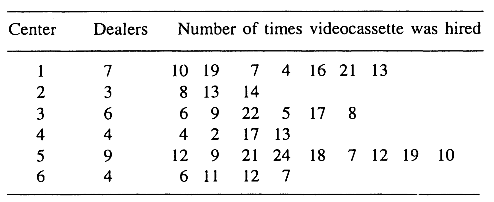
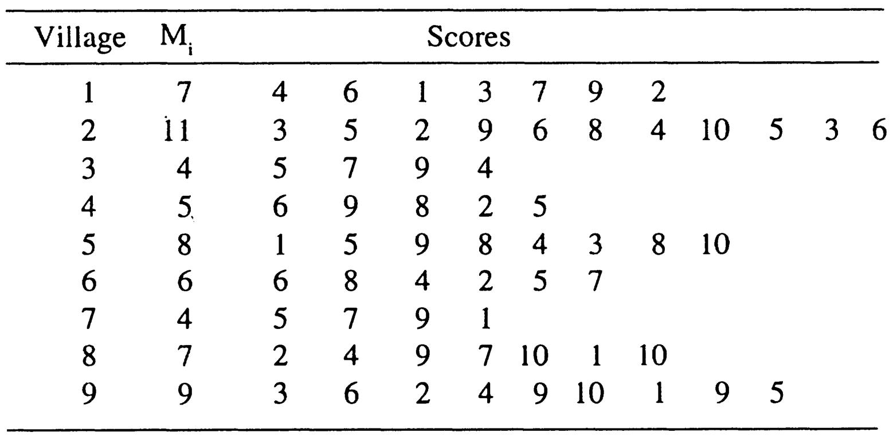
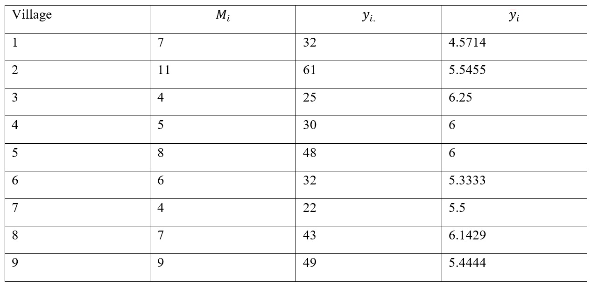

# 10th Tutorial 


::: {.exercise}
'Ramayana', the famous religious TV serial of India, was telecast for about
1 year and 9 months. Later, a private company released videocassette of this serial.
The company has 30 centers throughout India, and each center has its dealers. In
all, there are 250 dealers. After 6 months, an investigator wanted to estimate
the
total number of times a videocassette of the serial was hired after its
introduction in the market. For this purpose, six centers were selected using WOR
simple random sampling, and all the dealers in the sample centers were enumerated
for the number of times videocassette tapes of the serial were hired from the dealers.
The information, so obtained, is given in the following table.
:::





Estimate the average number of times a videocassette of the serial was hired
from a dealer, and place confidence limits on its population value.

**Solution: M is Known, we use estimator 1:**
$$N=30,~~M_o=250 ,~~~ n=6$$
 $$ \bar{M}= \frac{M_o}{N}= \frac{250}{30}= 8.3333$$
Estimate of the average amount of times a video cassette of the serial was hired from a dealer:
$$\bar{y}_{cl}=  \frac{N}{n M_o} \sum_{i=1}^{n}y_{i} = \frac{1}{\bar{M}n}  \sum_{i=1}^{n} y_{i.}$$ 

$$=\frac{1}{8.3333\times6} (90+35+67+36+132+36)=\frac{396}{49.9998}=7.9200$$
Estimate of variance:

$$var(\bar{y}_{cl})=\frac{N-n}{Nn\bar{M}^2}\frac{1}{n-1} \sum_{i=1}^{n} (y_i -\bar{M}\bar{y}_{cl})^2$$
$$\bar{M}\bar{y}_{cl}=(8.3333)(7.9200) = 65.9997$$

$$(\frac{30-6}{30\times6\times(8.3333)^2}) \frac{1}{5}[(90-65.9997)^2+(35-65.9997)^2+
(67-65.9997)^2+(36-65.9997)^2+(132-65.9997)^2+(36-65.9997)^2]
$$

$$=(0.0004)\times(7694)= 2.95452$$


Using above calculated estimate of variance, the standard error of mean will be

$$sd(\bar{y}_{cl})=\sqrt{(var(\bar{y}_{cl})}=\sqrt{2.95452}=1.7189$$

The required confidence limits for population mean are obtained as


$$\bar{y}_{cl}  \pm Z_{1-α/2}  \sqrt{(var(\bar{y}_{cl})}$$
$$7.9200±2\times(1.7189)$$
$$[ 4.4822, 11.3578]$$

```{r}
y = c(90,35,67,36,132,36)
M.vec = c(7,3,6,4,9,4) 
Mo=250
N= 30
n=length(y)
ybar.c = (1/(n*(Mo/N)))*sum(y)
ybar.c
s2.c= sum((y-mean(y))^2 )/(n-1)
var.c = ((N-n)/(N*n*(Mo/N)^2))*s2.c
var.c
ME = 2*sqrt(var.c) #margin of error(precision of estimate)
lower.CI=  ybar.c-ME
upper.CI=  ybar.c+ME
lower.CI;  upper.CI
ytotal.c= Mo*ybar.c
ytotal.c
var_ytotal.c=  Mo^2 *var.c
var_ytotal.c
# for finding the estimate of total?!!!!
# when Mo is known, we can use both estimators BUT
#check correlation between cluster means and the size of cluster
# if low, estimator 2 is preferred, if high, estimator 1 is preferred.
ytotal.c= Mo*ybar.c
ytotal.c
var_ytotal.c= Mo^2 *var.c
var_ytotal.c
```

::: {.exercise}
A sociologist is interested in determining the average degree of mental alertness
in persons of age over 80 years in a development block consisting of 70 villages.
Since the number of such individuals was not known for each village, a WOR
simple random sample of 9 villages was selected. All the persons, with age over
80 years in each selected village, were interviewed and then alertness was ranked
from 0 to 10. The score of 10 was given to the persons with perfect mental alertness,
whereas 0 score was meant for persons who were not in control of their mental
faculties. The number of persons with age over 80 years ($M_j$) and the scores for
their mental alertness, are given below for the sample villages.

:::



Estimate the average mental alertness for the population of persons aged above
80 years in the development block, and place confidence limits on this average.


**Solution:** $M_o=∑_{i=1}^N M_i$  is unknown, we use estimator 2
$N=70$,$M_o=$ unkown ,and $n=9$.
Estimate of the average metal alertness for the population of persons aged above 80 years:





$$\bar{y}_{cl} = \frac{1}{n} \sum_{i=1}^{n} \bar{y}_i$$
$$=\frac{1}{9}(4.5714+5.5455+6.25+6+6+ 5.3333+5.5+6.1429+5.4444)=\frac{ 50.7875}{9}= 5.6431$$

 Estimate of variance:
 
 $$var(\bar{y}_{cl})=\frac{N-n}{Nn}\frac{1}{n-1} \sum_{i=1}^{n} (y_i -\bar{y}_{cl})^2 = 0.0265$$
 
Using above calculated estimate of variance, the standard error of mean will be
$$sd(\bar{y}_{cl})=\sqrt{var(\bar{y}_{cl})}=\sqrt{0.0265}=0.1628$$
The required confidence limits for population mean are obtained as
$$\bar{y}_{cl}\pm Z_{1-α/2}  \sqrt{(var(\bar{y}_{cl})} $$ 
$5.6431 \pm 2\times(0.1628)$
$$[ 5.3175, 5.9687]$$


```{r}
#question 10.6 page 278
y = c(32,61,25,30,48,32,22,43,49)
M.vec = c(7,11,4,5,8,6,4,7,9) 
y_bar=y/M.vec
y_bar
N= 70
n=length(y)
n

ybar.c = (1/n)*sum(y_bar)
ybar.c
mean(y_bar)
5.643058
s2.c= sum((y_bar-mean(y_bar))^2 )/(n-1)
var.c = ((N-n)/(N*n))*s2.c
var.c
ME = 2*sqrt(var.c) #margin of error(precision of estimate)
lower.CI=  ybar.c-ME
upper.CI=  ybar.c+ME
lower.CI;  upper.CI

# for finding the estimate of total?!!!!
# when Mo not known, we only can use estimator 1
ytotal.c= (N/n)*sum(y)
ytotal.c
var_ytotal.c=  (N*(N-n)/(n*(n-1)))*sum((y- (ytotal.c/N))^2)
var_ytotal.c

```

Example 10.2 and 10.3 by R are going to very similar to exercise 10.4 and 10.6, so it’s left for students as HW